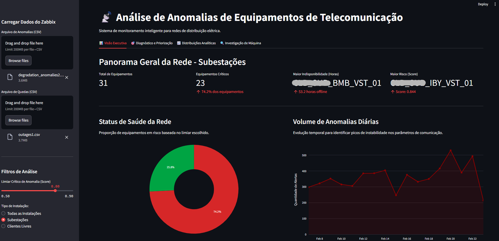

# Detecção de anomalias em redes de telecomunicação para Smartgrids baseada em Machine Learning 📡⚡

> Universidade Federal da Bahia (UFBA)
> 
> Autor: Elder dos Santos Guedes Pereira
>
> Orientador: Prof. Dr. Vitaly Felix Rodriguez Esquerre | Coorientador: João Vyctor Garcia
> 
> Semestre: 2026.1

## Sobre o Trabalho

### Introdução

Este repositório contém os algoritmos e a metodologia desenvolvidos no Trabalho de Conclusão de Curso (TCC) em Engenharia Elétrica. O projeto propõe a implementação de um modelo de **Machine Learning não supervisionado** para detectar padrões de degradação em enlaces de comunicação via satélite (VSAT) utilizados em redes elétricas inteligentes (*Smart Grids*), visando garantir a observabilidade contínua do sistema SCADA.

Este projeto inclui:

- Extração automatizada e processamento em lote de telemetria via **API do Zabbix**.
- Engenharia de atributos temporais e escalonamento robusto (mediana e IQR) adaptados para séries de redes.
- Detecção de anomalias isoladas utilizando o algoritmo **Isolation Forest**.
- Extração de regras e interpretabilidade através de Árvores de Decisão Substitutas (*Surrogate Trees*).
- Arquitetura *Prognostics and Health Management* (PHM) integrando a função **CUSUM (Soma Cumulativa)** para mitigar *concept drift*.
- Cálculo dinâmico do **Health Index (Índice de Saúde)** dos equipamentos de comunicação.
- Construção de painel gerencial e interface visual utilizando **Streamlit**.

### Resultados Alcançados

- **Escalabilidade:** Processamento validado em mais de 42.480 eventos anômalos distribuídos em 217 ativos de subestações.
- **Precisão:** Obtenção de *Recall* de 100% na detecção sobre o conjunto de equipamentos com falha real registrada nos laudos de campo.
- **Antecipação:** 84,6% dos alertas de degradação foram emitidos nas 6 horas que antecederam interrupções totais.
- **Impacto Operacional:** Validação em campo comprovou um *lead time* (tempo de antecipação) de **2 a 5 dias** para despachos de manutenção preventiva antes da queda do link.

### 🖥️ Ferramenta Gerencial (TAIS)

O produto final da pesquisa é a interface interativa **TAIS** (Tecnologia de Análise de Anomalias de Sistema), que cruza o Score de Anomalia com o SLA do equipamento para auxiliar a tomada de decisão da operação de rede.

## Equipe 6 - Colaboradores

<table>
  <tr>
    <td align="center">
      <a href="http://ivesvh.com">
        
         
        <b>Elder Pereira 💻</b>
      </a>
    </td>
  </tr>
</table>
